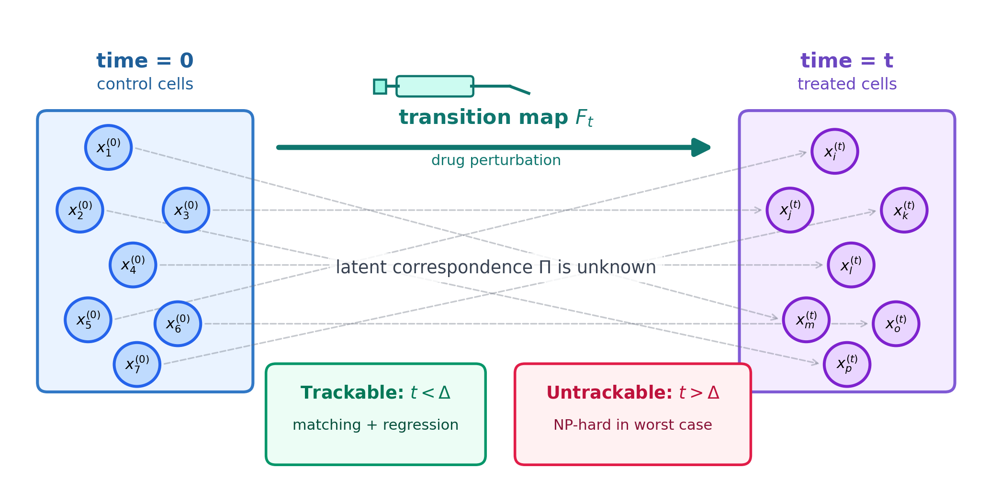
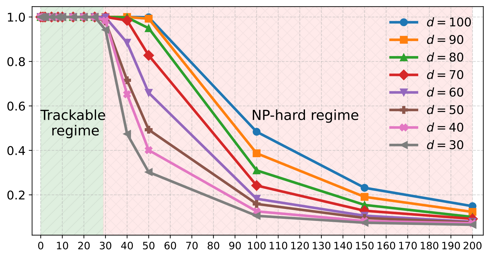
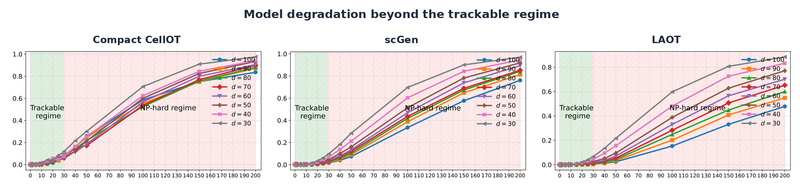
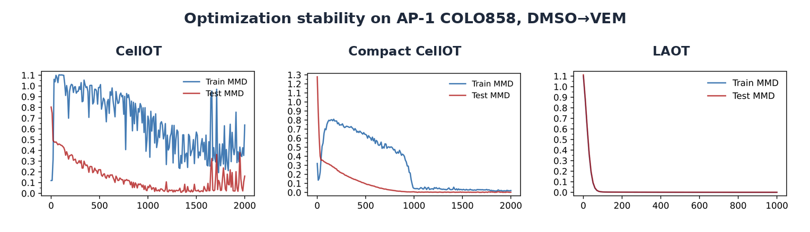

<h1 align="center">Single-Cell Perturbation Prediction and Trackability Regimes</h1>

<p align="center">
  <b>Code release for the ICML 2026 Spotlight Position Paper</b><br>
  <i>Position: Temporal Measurement Interval Determines Computational and Model Complexity in Single-Cell Perturbation Analysis</i>
</p>

<p align="center">
  <a href="https://github.com/alireza-jafari/SingleCellPerturbationPrediction-TrackabilityRegimes/blob/main/LICENSE"></a>
  
  
  
  
</p>

<p align="center">
  <a href="https://openreview.net/forum?id=lECKpTE1lW">OpenReview</a> ·
  <a href="https://icml.cc/virtual/2026/poster/67090">ICML Poster</a> ·
  <a href="https://github.com/alireza-jafari/SingleCellPerturbationPrediction-TrackabilityRegimes">Repository</a>
</p>

<p align="center">
  
</p>

---

## Overview

Single-cell perturbation analysis aims to predict how cellular states change after interventions such as drug treatments or genetic edits. A central difficulty is that pre- and post-perturbation measurements are typically observed as *unpaired* populations, so accurate prediction requires inferring a latent coupling and learning a transition map.

**In our position paper, we argue that the *measurement time gap* is the key experimental knob controlling both the computational tractability of coupling and the effective model complexity.**

This repository contains the implementation for the paper's synthetic experiments, biological benchmarks, baseline comparisons, and plotting scripts.

---

## Problem formulation

After a perturbation, cellular states evolve over time.

Let $x_1^{(0)}, \dots, x_n^{(0)} \in \mathbb{R}^d$ be i.i.d. pre-perturbation states drawn from an unknown distribution, and let $x_1^{(t)}, \dots, x_n^{(t)} \in \mathbb{R}^d$ be post-perturbation states measured at time $t$, but *without known pairing* to the pre-perturbation cells.

We assume there exists an *unknown* map $F_t : \mathbb{R}^d \to \mathbb{R}^d$ such that $x_i^{(t)} = F_t(x_{\sigma(i)}^{(0)})$ for some unknown permutation $\sigma$ of $[n] := \{1,2,\dots,n\}$.

The goal is to learn a map $F_t$ that allows us to predict the post-perturbation state of a new cell, namely, $x_{\mathrm{test}}^{(t)} \approx F_t\left(x_{\mathrm{test}}^{(0)}\right)$.

By definition, $F_0$ is the identity map, i.e., $F_0(x) = x$.

To formulate this compactly, we introduce the matrix $X^{(0)} \in \mathbb{R}^{d\times n}$ whose columns are $x_1^{(0)}, \dots, x_n^{(0)}$, and similarly define the matrix $X^{(t)} \in \mathbb{R}^{d\times n}$ containing the columns $x_1^{(t)}, \dots, x_n^{(t)}$.

Cell perturbation analysis can thus be viewed as supervised learning with unknown correspondences between predictor and response variables.

---

## Assumptions

Our results rely on biologically motivated insights and assumptions. In particular, we assume (i) *temporal smoothness* of the perturbation dynamics, and (ii) a *restricted isometry property* (RIP) for the pre-perturbation cell states.

In our experiments, we explicitly demonstrate regimes where these assumptions hold and settings where they break down.

### Smooth perturbation dynamics

Drug-induced perturbations act over time: a compound must engage its targets, trigger signaling cascades, and alter downstream transcriptional or translational programs before inducing measurable cellular responses.

We assume that the transition map $F_t$ is Lipschitz continuous in time, i.e.,

$$
\sup_x \|F_t(x) - F_{t'}(x)\| \leq L |t - t'|,
$$

for all $t,t'$, where $L > 0$ is a constant.

### Restricted isometry of initial states

The second assumption governing our theory and experiments concerns the geometric structure of the pre-perturbation data. Specifically, we rely on a restricted isometry property, originally introduced and extensively studied in compressed sensing.

Let $A \in \mathbb{R}^{p \times q}$ and $k \in \mathbb{N}$. We say that $A$ satisfies the $(k,\delta)$-RIP if $\delta$ is the smallest constant such that

$$
(1-\delta)\|v\|_2^2 \le \|A v\|_2^2 \le (1+\delta)\|v\|_2^2
$$

holds for all $k$-sparse vectors $v \in \mathbb{R}^q$.

Our analysis assumes that the data matrix $X^{(0)}$, whose columns correspond to pre-perturbation cell states, satisfies an RIP condition.

---

## Time-driven phase transition

**We identify a critical time gap $\Delta$ that induces a phase transition, under biologically inspired conditions; for measurement-time $>\Delta$, matching is polynomial-time tractable and the task reduces to supervised learning, whereas for measurement-time $>\Delta$, recovering the matching is NP-hard in the worst case.**

Define the measurement time gap

$$
\Delta \coloneqq \sqrt{\frac{1-\delta}{2nL^2}}.
$$

Then the problem of recovering the permutation $\sigma$ exhibits a phase transition as a function of time $t$:

| Regime | Condition | Computational consequence |
|---|---:|---|
| **Trackable regime** | $t < \Delta$ | The permutation $\sigma$ can be recovered in polynomial time as long as $X^{(0)}$ satisfies the $(2,\delta)$-RIP condition and the transition map is Lipschitz continuous in time. |
| **Untrackable regime** | $t > \Delta$ | Recovering $\sigma$, and consequently the transition map $F_t$, is NP-hard even when $F_t$ is a linear function. |

The theorem reveals that the trackable time gap is jointly governed by the geometric properties of the problem, where smoother transition dynamics (smaller Lipschitz constants) and robust initial RIP conditions directly extend the trackable time gap.

---

## Method: Linear Alternating Optimal Transport (LAOT)

The fundamental difficulty in solving the linear-transition problem is that the data are unpaired.

We study the problem of estimating a linear transition map of the form

$$
F_t(x) = W_\star^{(t)}x,
$$

where $W_\star^{(t)}$ is unknown.

Concretely, there exists an unknown permutation $\sigma:[n]\to[n]$ such that

$$
x_i^{(t)} = W_\star^{(t)} x_{\sigma(i)}^{(0)} \qquad (i=1,\dots,n).
$$

Let $\Pi_\star\in\Gamma$ be the permutation matrix induced by $\sigma$, so that $(X^{(0)}\Pi_\star)_{:,i}=X^{(0)}_{:,\sigma(i)}$, and $\Gamma$ denotes the Birkhoff polytope (the set of doubly stochastic matrices). Estimating the transition therefore amounts to recovering $(\Pi_\star,W_\star^{(t)})$ by least squares:

$$
\min_{\Pi\in\Gamma,\; W^{(t)}\in\mathbb{R}^{d\times d}} \;\;\big\|X^{(t)}- W^{(t)} X^{(0)} \Pi\big\|_F^2.
$$

The objective is not jointly convex in $(\Pi,W^{(t)})$. However, each block subproblem is polynomial-time solvable, motivating a natural alternating-minimization algorithm called Linear Alternating Optimal Transport (LAOT).

```text
Input: unpaired control samples X^(0), treated samples X^(t), iterations K
Initialize W^(t,0) = I_d

for k = 1, ..., K:
    1. Optimizing Π:
       solve the linear assignment / optimal transport problem

    2. Optimizing W^(t):
       solve the least-squares linear map update

Output: W^(t,K) and predictor x_new^(t) = W^(t,K) x_new^(0)
```

LAOT is not introduced for novelty, but as a minimal polynomial-time mechanism that isolates the source of computational hardness.

---

## Baseline implementations and provenance

We compare LAOT to representative nonlinear baselines discussed in the paper.

| Method | Role in this repository | Original implementation / reference code |
|---|---|---|
| **LAOT** | Implemented in this repository as the minimal linear alternating OT solver. | This repository. |
| **CellOT** | Nonlinear neural OT baseline. |  Implemented in this repository by modifying the official CellOT repository: <https://github.com/bunnech/cellot> |
| **Compact CellOT** | Reduced-capacity CellOT variant used to isolate the role of model capacity and computational complexity. | Implemented in this repository by modifying the CellOT architecture. |
| **scGen** | VAE-based generative baseline. | Official scGen repository: <https://github.com/theislab/scgen> |

CellOT parameterizes the transport map with an input-convex neural network and jointly learns the OT coupling and the mapping; their default configuration has four hidden layers with 64 units each, yielding a parameter count that is orders of magnitude larger than LAOT.

scGen is a VAE-based generative model that learns a latent representation and predicts perturbation responses via latent-space arithmetic rather than explicit correspondence recovery, again relying on a comparatively large number of learnable parameters.

We also modify Compact_CellOT, a reduced-capacity variant of CellOT (three hidden layers with 32 units each), used to isolate the role of model capacity and computational complexity.

---

## Visual summary

### Synthetic phase transition

<p align="center">
  
</p>

Figure shows a sharp two-regime behavior: for fine time gap $t$, LAOT recovers the matching with near-perfect probability, while beyond a critical time scale the recovery rate rapidly collapses.

### Nonlinear baselines also degrade beyond trackability

<p align="center">
  
</p>

This degradation is not limited to the linear solver: state-of-the-art nonlinear models exhibit the same collapse, indicating that model expressivity alone does not remove the intrinsic trackability barrier.

### Optimization stability in the trackable regime

<p align="center">
  
</p>

CellOT exhibits highly non-monotone training dynamics, whereas capacity reduction stabilizes training but can introduce long plateaus. LAOT converges rapidly with near-coincident train/test curves.

---

## What is in this repository?

The repository is organized around the main experimental blocks of the paper. Each folder contains notebooks for one benchmark or one analysis regime.

| Paper component | Repository folder | Notebooks / role |
|---|---|---|
| Synthetic phase transition and untrackable-regime tests | [`Synthetic_data_experiments/`](Synthetic_data_experiments/) | `Synthetic_data_permutation.ipynb`, `LAOT_Synthetic_data.ipynb`, `Compact_CellOT_Synthetic_data.ipynb`, `scGen_Synthetic_data.ipynb` |
| AP-1 within-context protein perturbation | [`AP-1_within_context_protein_perturbation/`](AP-1_within_context_protein_perturbation/) | LAOT, CellOT, Compact CellOT, and scGen notebooks for within-cell-line DMSO $\rightarrow$ VEM prediction |
| AP-1 replicate generalization | [`AP-1_within_context_protein_perturbation_replicate/`](AP-1_within_context_protein_perturbation_replicate/) | LAOT, CellOT, Compact CellOT, and scGen notebooks for cross-replicate robustness |
| AP-1 cross-context / OOD generalization | [`AP-1_cross_context_protein_perturbation_OOD/`](AP-1_cross_context_protein_perturbation_OOD/) | LAOT, CellOT, Compact CellOT, and scGen notebooks for held-out-cell-line transfer |
| 4i within-context protein-imaging perturbation | [`4i_within_context_protein_perturbation/`](4i_within_context_protein_perturbation/) | LAOT, CellOT, Compact CellOT, and scGen notebooks for 8h drug-response prediction |
| SciPlex3 within-context scRNA-seq perturbation | [`SciPlex3_within_context_scRNA-seq_perturbation/`](SciPlex3_within_context_scRNA-seq_perturbation/) | LAOT, CellOT, Compact CellOT, and scGen notebooks for 24h transcriptomic drug-response prediction |
| 2i biological time-course sweep | [`2i_time_course/`](2i_time_course/) | `LAOT_2i_time_course.ipynb` for 12h--168h horizon analysis |
| Paper plots | [`Plots/`](Plots/) | PDF plots used for training dynamics, 2i horizon sweep, and permutation recovery |
| README figures | [`assets/`](assets/) | PNG assets used in this README |

---

## Repository structure

```text
.
├── README.md
├── LICENSE
├── assets/
│   ├── overview_trackability.png
│   ├── synthetic_phase_transition.png
│   ├── untrackable_model_degradation.png
│   ├── optimization_stability.png
│   └── file.png
│
├── Plots/
│   ├── cellot_on_AP-1_drug_Vem_cell-line_COLO858_training.pdf
│   ├── compact_cellot_on_AP-1_drug_Vem_cell-line_COLO858_training.pdf
│   ├── laot_on_AP-1_drug_Vem_cell-line_COLO858_training.pdf
│   ├── mmd2_gamma_0.100_2i.pdf
│   └── permutation_recovery.pdf
│
├── Synthetic_data_experiments/
│   ├── Synthetic_data_permutation.ipynb
│   ├── LAOT_Synthetic_data.ipynb
│   ├── Compact_CellOT_Synthetic_data.ipynb
│   └── scGen_Synthetic_data.ipynb
│
├── AP-1_within_context_protein_perturbation/
│   ├── LAOT_AP-1_within_context.ipynb
│   ├── CellOT_AP-1_within_context.ipynb
│   ├── Compact_CellOT_AP-1_within_context.ipynb
│   └── scGen_AP-1_within_context.ipynb
│
├── AP-1_within_context_protein_perturbation_replicate/
│   ├── LAOT_AP-1_within_context_replicate.ipynb
│   ├── CellOT_AP-1_within_context_replicate.ipynb
│   ├── Compact_CellOT_AP-1_within_context_replicate.ipynb
│   └── scGen_AP-1_within_context_replicate.ipynb
│
├── AP-1_cross_context_protein_perturbation_OOD/
│   ├── LAOT_AP-1_cross_context.ipynb
│   ├── CellOT_AP-1_cross_context.ipynb
│   ├── Compact_CellOT_AP-1_cross_context.ipynb
│   └── scGen_AP-1_cross_context.ipynb
│
├── 4i_within_context_protein_perturbation/
│   ├── LAOT_4i_within_context.ipynb
│   ├── CellOT_4i_within_context.ipynb
│   ├── Compact_CellOT_4i_within_context.ipynb
│   └── scGen_4i_within_context.ipynb
│
├── SciPlex3_within_context_scRNA-seq_perturbation/
│   ├── LAOT_SciPlex3_within_context.ipynb
│   ├── CellOT_SciPlex3_within_context.ipynb
│   ├── Compact_CellOT_SciPlex3_within_context.ipynb
│   └── scGen_SciPlex3_within_context.ipynb
│
└── 2i_time_course/
    └── LAOT_2i_time_course.ipynb
```

---

## Installation

A minimal environment can be created with Conda:

```bash
conda create -n trackability python=3.10 -y
conda activate trackability

pip install numpy scipy pandas scikit-learn matplotlib seaborn tqdm jupyter ipykernel
pip install torch scanpy anndata pot
```

Some notebooks import CellOT-specific modules. Install CellOT following the official CellOT instructions, or add your local CellOT clone to `PYTHONPATH`:

```bash
# Example only; adjust to your local setup.
export PYTHONPATH=/path/to/cellot:$PYTHONPATH
```

For the 2i/WOT time-course experiments, install the WOT dependency if needed:

```bash
pip install wot
```

---

## Data setup

This repository does **not** redistribute the biological datasets. Please download each dataset from the original study or benchmark website, follow the corresponding license/terms of use, and cite the original data source in any derivative work. The synthetic experiments are generated directly by the notebooks and do not require an external dataset.

A convenient local layout is:

```text
data/
├── ap1/
├── 4i/
├── sciplex3/
└── reprogramming_2i/
```

Before running a notebook, update the dataset path variables in the first configuration cells. The notebooks were written to reproduce the paper experiments, so they may contain local paths that should be changed to match your machine.

| Dataset used in the paper | Original source to use | Notes for this repository |
|---|---|---|
| **AP-1 protein perturbations** | Comandante-Lou, Baumann, and Fallahi-Sichani, *Cell Reports* 2022: [study page / DOI](https://doi.org/10.1016/j.celrep.2022.111147), [PMC version](https://pmc.ncbi.nlm.nih.gov/articles/PMC9395172/), and the authors' [AP1-networkPlasticityMelanoma](https://github.com/fallahi-sichani-lab/AP1-networkPlasticityMelanoma) repository. In the paper, this benchmark is obtained from the original study page and **Supplementary Data S4**. | Used for DMSO $\rightarrow$ VEM protein perturbation prediction across melanoma cell lines. Place locally under `data/ap1/` after downloading. |
| **4i multiplexed protein-imaging perturbations** | Gut et al., *Science* 2018: [paper / DOI](https://doi.org/10.1126/science.aar7042). For the benchmark format used by CellOT, use Bunne et al., *Nature Methods* 2023: [CellOT repository](https://github.com/bunnech/cellot) and [ETH Research Collection processed datasets](https://doi.org/10.3929/ethz-b-000609681). | Used for drug-response prediction after 8h exposure. Place locally under `data/4i/`. |
| **SciPlex3 scRNA-seq perturbations** | Srivatsan et al., *Science* 2020: [paper / DOI](https://doi.org/10.1126/science.aax6234), [NCBI GEO GSE139944](https://www.ncbi.nlm.nih.gov/geo/query/acc.cgi?acc=GSE139944), and the authors' [sci-plex code repository](https://github.com/cole-trapnell-lab/sci-plex). The CellOT-preprocessed version can also be obtained from the CellOT processed datasets above. | Used for 24h transcriptomic drug-response prediction. Place locally under `data/sciplex3/`. |
| **2i reprogramming time-course** | Schiebinger et al., *Cell* 2019: [paper / DOI](https://doi.org/10.1016/j.cell.2019.01.006) and the [Waddington-OT tutorial/data page](https://broadinstitute.github.io/wot/tutorial/), which links the tutorial input data and transport maps. | Used for the 12h--168h time-gap sweep. Place locally under `data/reprogramming_2i/`. |

---

## Running experiments

Open the repository with Jupyter and run the notebook corresponding to the desired experiment:

```bash
jupyter lab
```

You can also execute a notebook from the command line. For example:

```bash
jupyter nbconvert --to notebook --execute \
  Synthetic_data_experiments/Synthetic_data_permutation.ipynb \
  --output Synthetic_data_permutation.executed.ipynb
```

---

## Benchmarks reproduced in this repository

| Benchmark | Modality | Setting | Main purpose |
|---|---|---|---|
| Synthetic near-identity data | simulated vectors | varying $t$ and $d$ | phase transition in latent permutation recovery |
| AP-1 | targeted protein panel | DMSO $\rightarrow$ VEM, 48h | within-cell-line and replicate perturbation prediction |
| 4i | multiplexed protein imaging | drug exposure, 8h | within-context drug perturbation prediction |
| SciPlex3 | scRNA-seq | 24h drug response | transcriptome-scale perturbation prediction |
| 2i time course | scRNA-seq trajectory | 12h to 168h horizons | biological time-gap sweep |
| Cross-cell-line AP-1 | targeted protein panel | held-out cell line | out-of-context generalization stress test |

### Representative paper results

Lower MMD$^2$ is better.

| Dataset | Condition | CellOT | scGen | Compact CellOT | LAOT |
|---|---:|---:|---:|---:|---:|
| AP-1 | COLO858 | 0.0995 | 0.0172 | 0.0019 | **0.0006** |
| AP-1 | WM902B | 0.0443 | 0.1423 | 0.0015 | **0.0007** |
| AP-1 | SKMEL19 | 0.1122 | 0.0323 | 0.0016 | **0.0011** |
| 4i | Imatinib | 0.0700 | 0.0330 | 0.0079 | **0.0063** |
| 4i | Trametinib | 0.0463 | 0.0098 | **0.0076** | 0.0080 |
| 4i | Dexamethasone | 0.0685 | 0.0160 | 0.0075 | **0.0071** |

| SciPlex3 drug | CellOT | scGen | Compact CellOT | LAOT |
|---|---:|---:|---:|---:|
| Trametinib | 0.0078 | 0.0059 | 0.0048 | **0.0040** |
| Givinostat | 0.0117 | 0.0083 | 0.0079 | **0.0033** |
| Abexinostat | 0.0129 | 0.0091 | 0.0074 | **0.0038** |

---

## Evaluation metric

We evaluate set-level prediction quality using the squared Maximum Mean Discrepancy (MMD$^2$), a kernel two-sample distance that is zero if and only if the underlying distributions match (for characteristic kernels).

Given samples $\mathcal{X}=\{x_i\}_{i=1}^{n}\subset\mathbb{R}^d$ and $\mathcal{Y}=\{y_j\}_{j=1}^{m}\subset\mathbb{R}^d$ and a positive definite kernel $k(\cdot,\cdot)$, we use the unbiased empirical estimator

$$
\widehat{\mathrm{MMD}}^2(\mathcal{X},\mathcal{Y};k) =
\frac{1}{n(n-1)}\sum_{i\neq i'} k(x_i,x_{i'}) +
\frac{1}{m(m-1)}\sum_{j\neq j'} k(y_j,y_{j'})
-\frac{2}{nm}\sum_{i=1}^{n}\sum_{j=1}^{m} k(x_i,y_j).
$$

In all experiments, we use the Gaussian RBF kernel

$$
k_{\gamma}(u,v)=\exp\!\big(-\gamma \|u-v\|_2^2\big).
$$

Unless stated otherwise, we choose $\gamma$ via the median heuristic *using the training split only* to avoid test leakage.

---

## Reproducibility notes

- Update all local data paths before running the biological notebooks.
- Use the same train/test split protocol as the corresponding notebook.
- For MMD$^2$, select the RBF bandwidth from the training split only to avoid test leakage.
- LAOT is effectively deterministic after the split is fixed, because it uses a linear assignment step and a least-squares map update.
- Neural baselines can have nontrivial variance across random seeds. Report mean $\pm$ standard deviation over repeated runs.
- The untrackable regime should be interpreted as a computational/statistical barrier, not merely as a failure of one solver.

---

## Generative AI disclosure

Generative AI tools were used to assist with parts of the implementation, including evaluation utilities, plotting scripts, documentation, and reproducibility instructions. All scientific claims, experimental results, final manuscript text, and released code were reviewed, edited, tested, and validated by the authors.

---

## Repository topics

`single-cell` · `perturbation-prediction` · `optimal-transport` · `linear-assignment` · `cellot` · `scgen` · `mmd` · `icml-2026` · `trackability` · `computational-complexity`

---

## Citation

If this repository is useful for your work, please cite:

```bibtex
@inproceedings{jafari2026temporal,
  title     = {Position: Temporal Measurement Interval Determines Computational and Model Complexity in Single-Cell Perturbation Analysis},
  author    = {Jafari, Alireza and Shakeri, Heman and Daneshmand, Hadi},
  booktitle = {Proceedings of the 43rd International Conference on Machine Learning},
  series    = {Proceedings of Machine Learning Research},
  volume    = {306},
  year      = {2026},
  url       = {https://openreview.net/forum?id=lECKpTE1lW}
}
```

---

## License

This repository is released under the MIT License. See [`LICENSE`](LICENSE) for details.
